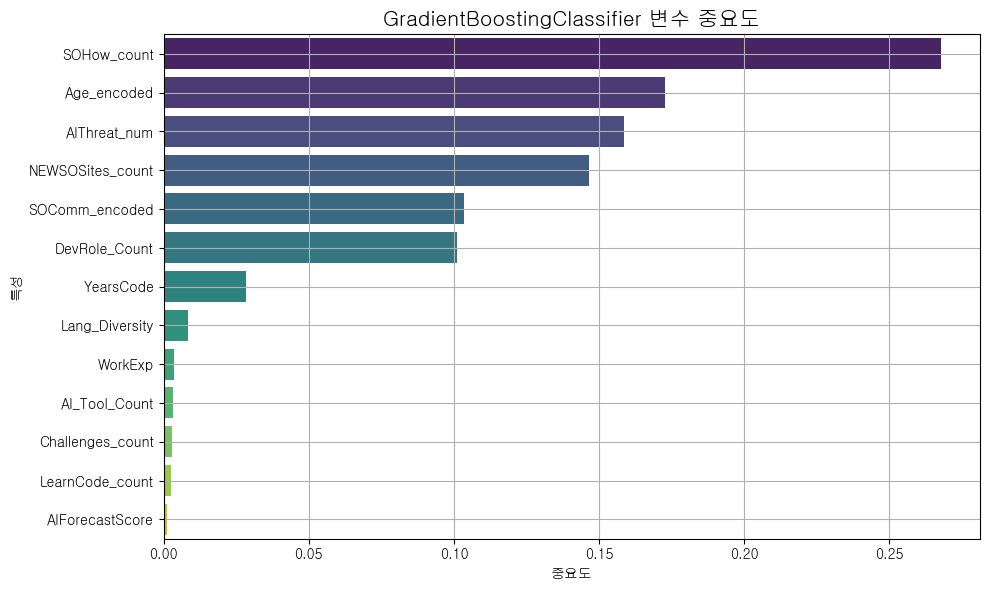

# **AI 시대, Stack Overflow 핵심 개발자 이탈 예측 및 활성화 방안 연구**

## 1. **팀 소개**

### GPT한테 물어볼게요
"왜 이탈하냐고요? GPT한테 물어보거든요."

<br>

## 🌟 **팀원 소개**  

| 정의중 | 임길진 | 이민영| 신승철 | 김주서 |
|---|---|---|---|---|
|  |  |  |  |  | 
|[@uii42](https://github.com/uii42)| [@LGJ0405](https://github.com/LGJ0405) | [@mylee99125](https://github.com/mylee99125) | [@ssshinnpson](https://github.com/ssshinnpson) | [@kimjuseo71](https://github.com/kimjuseo71)|

<br>

## 2. 프로젝트 개요

### 2.1 프로젝트 주제 선정 배경


<br>


<br>

2023년을 기점으로 ChatGPT와 같은 생성형 AI 도구가 보편화되면서 개발자들의 정보 검색 및 문제 해결 방식에 패러다임 전환이 일어나고 있습니다. 이로 인해 세계 최대 개발자 Q&A 커뮤니티인 Stack Overflow는 질문 및 답변 수가 급감하는 심각한 도전에 직면했습니다.

이는 단순한 트래픽 감소를 넘어, 커뮤니티의 지식 생태계를 지탱해 온 **핵심 개발자(High-contribution developers)들의 이탈**을 가속화할 수 있습니다. 전문가들의 이탈은 곧 답변의 질적 저하로 이어지고, 이는 다시 일반 사용자들의 이탈을 유발하여 플랫폼의 장기적인 신뢰도와 가치를 훼손하는 악순환을 낳을 수 있습니다.

따라서, 어떤 개발자가 커뮤니티를 떠날 위험이 높은지 선제적으로 파악하고, 그 원인을 데이터 기반으로 분석하는 것은 커뮤니티의 지속 가능성을 위해 매우 중요합니다. 본 프로젝트는 바로 이 문제를 해결하고자 합니다.

<br>

### 2.2 프로젝트 목적
본 프로젝트의 목표는 다음과 같습니다.

1. **핵심 기여자 이탈 예측 모델 구축**
    - Stack Overflow 설문 데이터의 사용자 행동(`SOHow`, `SOComm` 등) 및 인식 변수(`AIThreat`, `AIChallenges` 등)를 활용하여, 커뮤니티 핵심 기여자의 이탈 여부를 예측하는 **정확도 높은 머신러닝 모델을 구축**한다.
2. **이탈 영향 요인 분석**
    - 구축된 모델의 피처 중요도(Feature Importance) 분석을 통해, 개발자 이탈에 영향을 미치는 **핵심 요인을 식별하고 정량적으로 제시**한다.
3. **데이터 기반 솔루션 프로토타입 제안**
    - 분석된 인사이트를 바탕으로, 이탈 가능성이 높은 사용자에게 제공할 수 있는 **개인화된 활성화 솔루션 프로토타입을 Streamlit으로 구현**하여 실질적인 해결 방안의 가능성을 제시한다.


**데이터 출처**
## 📊 데이터 출처

[Stack Overflow Annual Developer Survey](https://survey.stackoverflow.co/) 의 설문 데이터를 사용했습니다.


<br>

## 3. **기술 스택**

| **분류**         | **기술/도구** |
|------------------|------------------------------------------------------------------------------------------|
| **언어**         |      |
| **라이브러리**   |          <br>   <br>  <br> |
| **협업 툴**      |   |

<br>

## 4. WBS

<!-- WBS 넣을 장소 -->
<!--  -->
<br>

## 5. 데이터 전처리 및 EDA (탐색적 데이터 분석)

#### **분석 타겟 컬럼**

| 변수명 | 설명 | 데이터 타입 |
|--------|------|--------------|
| `LearningCode_count` | 코딩 학습 방법 개수 | `int64` |
| `Lang_Diversity` | 사용 프로그래밍 언어 다양성 | `int64` |
| `AI_Tool_Count` | 사용 중인 AI 도구 수 | `int64` |
| `WorkExp` | 실무 경력 | `float64` |
| `YearsCode` | 코딩 경험 연차 | `float64` |
| `DevRole_Count` | 담당 개발 역할 수 | `int64` |
| `SOHow_count` | Stack Overflow 방문 이유 개수 | `int64` |
| `SOComm_encoded` | Stack Overflow 커뮤니티 인식 수준 | `int64` |
| `NEWSOSites_count` | Stack Overflow 외 사이트 방문 수 | `int64` |
| `Age_encoded` | 나이 | `float64` |
| `Challenges_count` | AI 도구 사용 시 겪는 문제 수 | `int64` |
| `AIForecastScore` | AI 전망 점수 | `int64` |
| `AIThreat_num` | AI 위협 인식 수준 (수치화) | `float64` |
| `is_churned` | 이탈 여부 (타겟 변수) | `int64` |


<br>

- 결측치 처리
``` python
df = df.dropna(subset=['SOVisitFreq'])
df['WorkExp'] = df['WorkExp'].fillna(0)
df['YearsCode'] = df['YearsCode'].replace({
    'Less than 1 year': 0.5,
    'More than 50 years': 51
}).astype(float).fillna(0)
for col in [
    'AIToolCurrently Using',
    'AINextMuch more integrated',
    'AINextMore integrated',
    'AIChallenges'
]:
    df[col] = df[col].where(pd.notnull(df[col]), np.nan)
df['AIThreat'] = df['AIThreat'].fillna("I'm not sure")

df = df.dropna(subset=['Age_encoded'])

df['SOComm_encoded'] = df['SOComm_encoded'].fillna(0)
```

- countMultipleResponses 함수 사진

``` python
def countMultipleResponses(value):
    if pd.isna(value) or str(value).strip() == "":
        return 0
    return len(re.findall(r"[;,]", str(value))) + 1
```

- 이거로 처리한 count애들 사진
``` python
df['LearnCode_count'] = df['LearnCode'].apply(countMultipleResponses)
df['Lang_Diversity'] = df['LanguageHaveWorkedWith'].apply(countMultipleResponses)
df['AI_Tool_Count'] = df['AIToolCurrently Using'].apply(countMultipleResponses)
df['DevRole_Count'] = df['DevType'].apply(countMultipleResponses)
df['SOHow_count'] = df['SOHow'].apply(countMultipleResponses)
df['NEWSOSites_count'] = df['NEWSOSites'].apply(countMultipleResponses)
df['Challenges_count']= df['AIChallenges'].apply(countMultipleResponses)

```

- 이외 encoding들 
``` python
so_comm_order = {
    'No, not at all': 0,
    'No, not really': 1,
    'Not sure': 2,
    'Neutral': 3,
    'Yes, somewhat': 4,
    'Yes, definitely': 5
}

df['SOComm_encoded'] = df['SOComm'].fillna('Neutral').map(so_comm_order)

df['AIThreat_num'] = df['AIThreat'].map({
    'Yes': 1,
    'No': 0,
    "I'm not sure": 0.5
})

age_order = {
    'Under 18 years old': 0,
    '18-24 years old': 1,
    '25-34 years old': 2,
    '35-44 years old': 3,
    '45-54 years old': 4,
    '55-64 years old': 5,
    '65 years or older': 6,
    'Prefer not to say': np.nan
}

df['Age_encoded'] = df['Age'].map(age_order)

```

- AIForecastScore 도출 
``` python
df['AINextMuch_more_count'] = df['AINextMuch more integrated'].apply(countMultipleResponses)
df['AINextMore_count'] = df['AINextMore integrated'].apply(countMultipleResponses)
df['AINextLess_count'] = df['AINextLess integrated'].apply(countMultipleResponses)
df['AINextMuch_less_count'] = df['AINextMuch less integrated'].apply(countMultipleResponses)

df['AIForecastScore'] = (
    df['AINextMuch_more_count'] * 2 
    + df['AINextMore_count']
    - df['AINextLess_count']
    - df['AINextMuch_less_count'] * 2
)

```

- is_churned -> 이탈 기준 뭐로 잡았는지
``` python
df['is_churned'] = df['SOVisitFreq'].apply(lambda x: 1 if x in ['Less than once per month or monthly', 'I don’t visit Stack Overflow'] else 0)
```

#### 히트맵


## 6. 인공지능 학습 결과서

### 모델별 학습 결과

- Logistic Regression: 로지스틱 회귀 <br>

```
🔍 최적 임계값 (Optimal threshold): 0.41
✅ 학습 정확도: 0.7764806104818583

✅ 정확도 (Accuracy): 0.7719026707940393
✅ 정밀도 (Precision): 0.7307551319648093
✅ 재현율 (Recall): 0.861061118709956
✅ F1 Score: 0.7905747050464325

📊 혼동 행렬 (Confusion Matrix):
[[ 9484  4407]
[ 1930 11961]]

📋 분류 리포트 (Classification Report):
              precision    recall  f1-score   support

          0       0.83      0.68      0.75     13891
          1       0.73      0.86      0.79     13891

    accuracy                           0.77     27782
  macro avg       0.78      0.77      0.77     27782
weighted avg       0.78      0.77      0.77     27782
```

<br>


<br>

- Decision Tree : 결정 트리 회귀 <br>

```DecisionTreeClassifier:
🔍 최적 임계값 (Optimal threshold): 0.36
✅ 학습 정확도: 0.9341524284891534

✅ 정확도 (Accuracy): 0.8811100712691671
✅ 정밀도 (Precision): 0.8550637156270959
✅ 재현율 (Recall): 0.9177884961485854
✅ F1 Score: 0.8853164820665949

📊 혼동 행렬 (Confusion Matrix):
 [[11730  2161]
 [ 1142 12749]]

📋 분류 리포트 (Classification Report):
               precision    recall  f1-score   support

           0       0.91      0.84      0.88     13891
           1       0.86      0.92      0.89     13891

    accuracy                           0.88     27782
   macro avg       0.88      0.88      0.88     27782
weighted avg       0.88      0.88      0.88     27782
```
<br>


<br>

- Random Forest : 랜덤 포레스트 회귀 <br>

```
RandomForestClassifier
🔍 최적 임계값 (Optimal threshold): 0.49
✅ 학습 정확도: 0.941183528508351

✅ 정확도 (Accuracy): 0.9141530487365921
✅ 정밀도 (Precision): 0.90859375
✅ 재현율 (Recall): 0.9209560146857677
✅ F1 Score: 0.9147331164420293

📊 혼동 행렬 (Confusion Matrix):
 [[12604  1287]
 [ 1098 12793]]

📋 분류 리포트 (Classification Report):
               precision    recall  f1-score   support

           0       0.92      0.91      0.91     13891
           1       0.91      0.92      0.91     13891

    accuracy                           0.91     27782
   macro avg       0.91      0.91      0.91     27782
weighted avg       0.91      0.91      0.91     27782
```
<br>


<br>

- Gradient Boosting : 그래디언트 부스팅 회귀 <br>

```
GradientBoostingClassifier:
🔍 최적 임계값 (Optimal threshold): 0.50
✅ 학습 정확도: 0.9035683432520637

✅ 정확도 (Accuracy): 0.9006191058959038
✅ 정밀도 (Precision): 0.9210805084745762
✅ 재현율 (Recall): 0.876322798934562
✅ F1 Score: 0.8981443907477773

📊 혼동 행렬 (Confusion Matrix):
 [[12848  1043]
 [ 1718 12173]]

📋 분류 리포트 (Classification Report):
               precision    recall  f1-score   support

           0       0.88      0.92      0.90     13891
           1       0.92      0.88      0.90     13891

    accuracy                           0.90     27782
   macro avg       0.90      0.90      0.90     27782
weighted avg       0.90      0.90      0.90     27782
```
<br>



<br>

- XGBoost : eXtreme Gradient Boosting 회귀 <br>

```
XGBClassifier:
🔍 최적 임계값 (Optimal threshold): 0.46
✅ 학습 정확도: 0.9445550969475907

✅ 정확도 (Accuracy): 0.9326542365560435
✅ 정밀도 (Precision): 0.9456473379801276
✅ 재현율 (Recall): 0.9180764523792384
✅ F1 Score: 0.9316579610622056

📊 혼동 행렬 (Confusion Matrix):
 [[13158   733]
 [ 1138 12753]]

📋 분류 리포트 (Classification Report):
               precision    recall  f1-score   support

           0       0.92      0.95      0.93     13891
           1       0.95      0.92      0.93     13891

    accuracy                           0.93     27782
   macro avg       0.93      0.93      0.93     27782
weighted avg       0.93      0.93      0.93     27782
```
<br>


<br>

<!-- 필요시 작성
### 필요한 막대그래프 -->

<br>

## 7. 수행 결과

- AI는 상관관계 크게 없음
- SOHow_count, NEWSOSites, DevRole, SOComm
- 데이터 불균형 심함. SMOTE 한거

<br>

## 📊 수행 결과

본 프로젝트에서는 Stack Overflow 핵심 기여자의 이탈 여부를 예측하기 위해 다양한 머신러닝 모델을 비교·분석한 결과, **XGBoost 모델이 Accuracy 93.27%, F1 Score 0.93**으로 가장 우수한 성능을 보였다.  

데이터 분석 결과, **AI 활용 여부는 이탈 여부와 뚜렷한 상관관계를 보이지 않았다**. 대신, 변수 중요도 분석에서 **SOHow_count**(커뮤니티 방문 사유 수), **NEWSOSites_count**(다른 Stack Overflow 사이트 이용 수), **DevRole**(개발자 역할 수), **SOComm**(커뮤니티 인식 수준) 네 가지 변수가 예측 정확도에 크게 기여하는 핵심 요인으로 나타났다.  

또한, 데이터 분포 분석에서 **심각한 클래스 불균형**이 확인되었으며, 이를 개선하기 위해 **SMOTE** 기법을 적용하여 모델 학습 안정성과 소수 클래스 예측 성능을 향상시켰다.  

### 🔍 주요 인사이트
1. **AI 사용 여부보다 커뮤니티와의 상호작용 지표가 이탈 예측에 더 중요**하다.  
2. **다양한 개발자 역할을 가진 사용자일수록 커뮤니티 잔존 확률이 높다** → 폭넓은 활동과 지식 공유가 참여 지속성에 긍정적 영향.  
3. **다른 관련 사이트 이용 경험이 많을수록 커뮤니티 유지 가능성이 높다** → 플랫폼 생태계 확장 전략이 유지율 개선에 도움.  
4. 데이터 불균형 문제를 해결하지 않으면, 모델이 다수 클래스(비이탈)에 치우쳐 소수 클래스(이탈) 예측 성능이 저하될 가능성 큼.

### ⚠ 한계점
- **설문 기반 데이터 한계**: Stack Overflow 설문 응답 데이터에 기반하여, 응답자의 자기보고(self-reported) 편향이 존재할 수 있음.  
- **일시적 스냅샷 데이터**: 단일 시점 데이터로 장기적인 추세나 계절성을 반영하기 어려움.  
- **설명 변수 제약**: SOHow_count, NEWSOSites 등 일부 행동 지표만 포함되어, 실제 이탈에 영향을 주는 심리적·환경적 요인을 충분히 반영하지 못함.  
- **불균형 데이터 보정의 한계**: SMOTE 적용으로 소수 클래스 예측 성능은 개선했으나, 합성 데이터가 실제 행동 패턴을 완전히 대변하지는 못함.  

### 💡 제안 방안
- **개인화된 리텐션 전략**: 방문 사유가 감소하거나 특정 개발 역할 활동이 줄어드는 사용자를 대상으로 맞춤형 알림, 추천 질문, 관심 주제 콘텐츠 제공.
- **생태계 확장형 이벤트**: 다른 Stack Overflow 네트워크 사이트나 개발 관련 커뮤니티와의 연계 이벤트를 통해 교차 방문 촉진.
- **커뮤니티 인식 개선 프로그램**: SOComm 점수가 낮은 사용자에게 커뮤니티 가치와 기여 혜택을 강조하는 온보딩 콘텐츠 제공.
- **장기 데이터 확보**: 연도별·분기별 데이터를 누적 수집하여 추세 분석과 예측 모델의 일반화 성능 개선.
- **행동 로그 기반 변수 추가**: 실제 질문 작성, 답변 채택, 댓글 참여 등의 세부 로그 데이터를 결합하여 예측 정밀도 향상.

<br>

개요에서 시작된 문제점에 대한 해결 방안 등등

<!-- 필요시 작성
#### - 최종 변수 결과
 -->

<br>

🌈 **팀원 한 줄 회고**
<table>
  <tr>
    <th>이름</th>
    <th>회고 내용</th>
  </tr>
  <tr>
    <td>정의중</td>
    <td></td>
  </tr>
  <tr>
    <td>임길진</td>
    <td></td>
  </tr>
  <tr>
    <td>신승철</td>
    <td></td>
  </tr>
  <tr>
    <td>이민영</td>
    <td></td>
  </tr>
  <tr>
    <td>김주서</td>
    <td></td>
  </tr>
</table>

<br>


<br>
