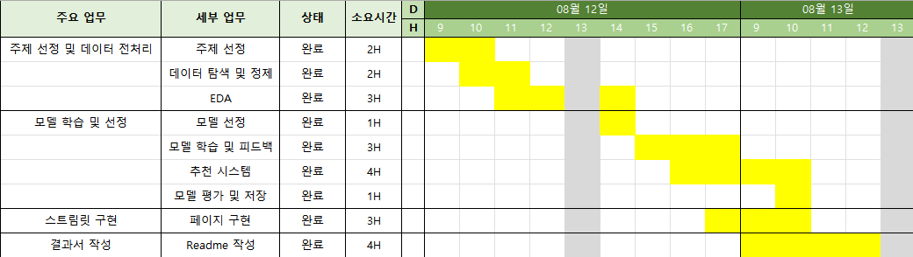
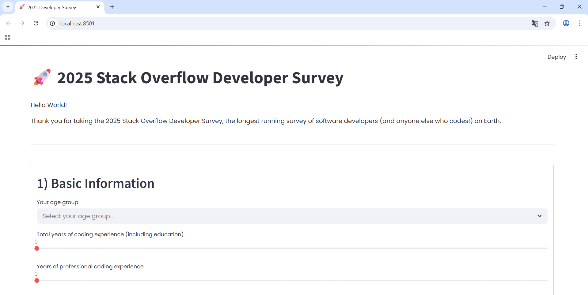
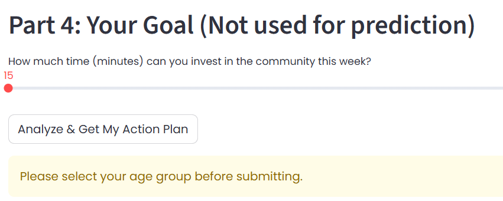
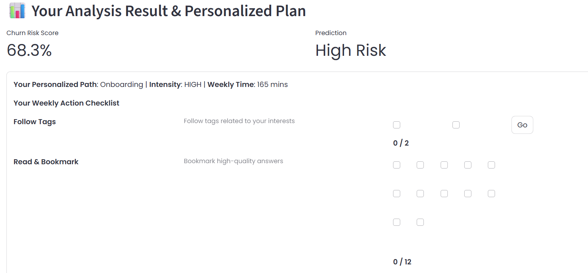

# **Stack Overflow 핵심 개발자 이탈 예측 및 활성화 방안 연구**

## 1. **팀 소개**

### GPT한테 물어볼게요
"왜 이탈하냐고요? GPT한테 물어보거든요."

<br>

## 🌟 **팀원 소개**  

| 정의중 | 임길진 | 이민영| 신승철 | 김주서 |
|---|---|---|---|---|
|  |  |  |  |  | 
|[@uii42](https://github.com/uii42)| [@LGJ0405](https://github.com/LGJ0405) | [@mylee99125](https://github.com/mylee99125) | [@ssshinnpson](https://github.com/ssshinnpson) | [@kimjuseo71](https://github.com/kimjuseo71)|

<br>

## 2. 프로젝트 개요

### 2.1 프로젝트 주제 선정 배경

2023년을 기점으로 ChatGPT와 같은 생성형 AI 도구가 보편화되면서 개발자들의 정보 검색 및 문제 해결 방식에 패러다임 전환이 일어나고 있다. 이로 인해 세계 최대 개발자 Q&A 커뮤니티인 Stack Overflow는 질문 및 답변 수가 급감하는 심각한 도전에 직면했다.

이는 단순한 트래픽 감소를 넘어, 커뮤니티의 지식 생태계를 지탱해 온 **핵심 개발자(High-contribution developers)들의 이탈**을 가속화할 수 있다. 전문가들의 이탈은 곧 답변의 질적 저하로 이어지고, 이는 다시 일반 사용자들의 이탈을 유발하여 플랫폼의 장기적인 신뢰도와 가치를 훼손하는 악순환을 낳을 수 있다.

본 프로젝트는 설문 데이터를 기반으로 **이탈 가능성이 높은 개발자를 선제적으로 예측**하고, 커뮤니티의 지속 가능성을 위한 해결 방안을 모색하고자 시작되었다.

<br>


<br>


출처: The Decline of Stack Overflow, Tomaž Weiss
<br>

### 2.2 프로젝트 목적
본 프로젝트의 목표는 다음과 같다.

1. **핵심 이탈 요인 분석**
    - 머신러닝 모델의 Feature Importance 분석을 통해, 개발자 이탈에 영향을 미치는 **핵심 요인을 식별하고 정량적으로 제시**한다.
2. **솔루션 프로토타입 제안**
    - 분석된 인사이트를 바탕으로, 이탈 고위험군 사용자에게 **개인화된 활성화 솔루션을 제공하는 Streamlit 프로토타입을 구현**한다.

### 2.3 데이터 출처

- Stack Overflow Annual Developer Survey: https://survey.stackoverflow.co/ 설문 데이터

<br>

## 3. **기술 스택**

| **분류**       | **기술/도구** |
|----------------|------------------------------------------------------------------------------------------------------------------------------------------------------------------------------------------------------------------------------------------------------------------|
| **언어**       |  |
| **데이터 처리** |   |
| **시각화**     |   |
| **모델링**     |    |
| **불균형 처리** |  |
| **모델 저장**   |  |
| **협업 툴**     |   |

<br>

## 4. WBS



<br>

## 5. 데이터 전처리 및 EDA (탐색적 데이터 분석)

모델링에 사용할 주요 변수를 선정하고, 결측치 처리 및 파생 변수 생성을 통해 데이터를 정제한다.
또한 텍스트 형태의 다중 응답 데이터를 수치화하고, 순서형 변수는 인코딩하여 모델이 학습할 수 있는 형태로 변환한다.

#### 분석 타겟 컬럼

| 변수명 | 설명 | 데이터 타입 |
|--------|------|--------------|
| `LearningCode_count` | 코딩 학습 방법 개수 | `int64` |
| `Lang_Diversity` | 사용 프로그래밍 언어 다양성 | `int64` |
| `AI_Tool_Count` | 사용 중인 AI 도구 수 | `int64` |
| `WorkExp` | 실무 경력 | `float64` |
| `YearsCode` | 코딩 경험 연차 | `float64` |
| `DevRole_Count` | 담당 개발 역할 수 | `int64` |
| `SOHow_count` | Stack Overflow 방문 이유 개수 | `int64` |
| `SOComm_encoded` | Stack Overflow 커뮤니티 인식 수준 | `int64` |
| `NEWSOSites_count` | Stack Overflow 외 사이트 방문 수 | `int64` |
| `Age_encoded` | 나이 | `float64` |
| `Challenges_count` | AI 도구 사용 시 겪는 문제 수 | `int64` |
| `AIForecastScore` | AI 전망 점수 | `int64` |
| `AIThreat_num` | AI 위협 인식 수준 (수치화) | `float64` |
| `is_churned` | 이탈 여부 (타겟 변수) | `int64` |

<br>

#### 결측치 처리

``` python
df = df.dropna(subset=['SOVisitFreq'])
df['WorkExp'] = df['WorkExp'].fillna(0)
df['YearsCode'] = df['YearsCode'].replace({
    'Less than 1 year': 0.5,
    'More than 50 years': 51
}).astype(float).fillna(0)
for col in [
    'AIToolCurrently Using',
    'AINextMuch more integrated',
    'AINextMore integrated',
    'AIChallenges'
]:
    df[col] = df[col].where(pd.notnull(df[col]), np.nan)
df['AIThreat'] = df['AIThreat'].fillna("I'm not sure")

df = df.dropna(subset=['Age_encoded'])

df['SOComm_encoded'] = df['SOComm_encoded'].fillna(0)
```

<br>

#### countMultipleResponses 함수

``` python
def countMultipleResponses(value):
    if pd.isna(value) or str(value).strip() == "":
        return 0
    return len(re.findall(r"[;,]", str(value))) + 1
```

<br>

#### 개수로 처리한 column

``` python
df['LearnCode_count'] = df['LearnCode'].apply(countMultipleResponses)
df['Lang_Diversity'] = df['LanguageHaveWorkedWith'].apply(countMultipleResponses)
df['AI_Tool_Count'] = df['AIToolCurrently Using'].apply(countMultipleResponses)
df['DevRole_Count'] = df['DevType'].apply(countMultipleResponses)
df['SOHow_count'] = df['SOHow'].apply(countMultipleResponses)
df['NEWSOSites_count'] = df['NEWSOSites'].apply(countMultipleResponses)
df['Challenges_count']= df['AIChallenges'].apply(countMultipleResponses)

```

<br>

#### encoding 처리한 column

``` python
so_comm_order = {
    'No, not at all': 0,
    'No, not really': 1,
    'Not sure': 2,
    'Neutral': 3,
    'Yes, somewhat': 4,
    'Yes, definitely': 5
}

df['SOComm_encoded'] = df['SOComm'].fillna('Neutral').map(so_comm_order)

df['AIThreat_num'] = df['AIThreat'].map({
    'Yes': 1,
    'No': 0,
    "I'm not sure": 0.5
})

age_order = {
    'Under 18 years old': 0,
    '18-24 years old': 1,
    '25-34 years old': 2,
    '35-44 years old': 3,
    '45-54 years old': 4,
    '55-64 years old': 5,
    '65 years or older': 6,
    'Prefer not to say': np.nan
}

df['Age_encoded'] = df['Age'].map(age_order)
```

<br>

#### AIForecastScore 도출

``` python
df['AINextMuch_more_count'] = df['AINextMuch more integrated'].apply(countMultipleResponses)
df['AINextMore_count'] = df['AINextMore integrated'].apply(countMultipleResponses)
df['AINextLess_count'] = df['AINextLess integrated'].apply(countMultipleResponses)
df['AINextMuch_less_count'] = df['AINextMuch less integrated'].apply(countMultipleResponses)

df['AIForecastScore'] = (
    df['AINextMuch_more_count'] * 2 
    + df['AINextMore_count']
    - df['AINextLess_count']
    - df['AINextMuch_less_count'] * 2
)
```

<br>

#### label column

타겟 변수인 `is_churned`(이탈 여부)의 분포가 심각한 불균형을 이루고 있어, 소수 클래스(이탈 그룹)의 예측 성능을 높이기 위해 **SMOTE** 기법으로 데이터를 증강했습니다.

``` python
df['is_churned'] = df['SOVisitFreq'].apply(lambda x: 1 if x in ['Less than once per month or monthly', 'I don’t visit Stack Overflow'] else 0)
```

<br>

<div align='center'>


</div>

<br>

#### 히트맵


<br>

## 6. 인공지능 학습 결과서

### 모델별 학습 결과

- ### Logistic Regression: 로지스틱 회귀 <br>

```
🔍 최적 임계값 (Optimal threshold): 0.41
✅ 학습 정확도: 0.7764806104818583

✅ 정확도 (Accuracy): 0.7719026707940393
✅ 정밀도 (Precision): 0.7307551319648093
✅ 재현율 (Recall): 0.861061118709956
✅ F1 Score: 0.7905747050464325

📊 혼동 행렬 (Confusion Matrix):
[[ 9484  4407]
[ 1930 11961]]

📋 분류 리포트 (Classification Report):
              precision    recall  f1-score   support

          0       0.83      0.68      0.75     13891
          1       0.73      0.86      0.79     13891

    accuracy                           0.77     27782
  macro avg       0.78      0.77      0.77     27782
weighted avg       0.78      0.77      0.77     27782
```

<br>


<br>

- ### Decision Tree : 결정 트리 회귀 <br>

```DecisionTreeClassifier:
🔍 최적 임계값 (Optimal threshold): 0.36
✅ 학습 정확도: 0.9341524284891534

✅ 정확도 (Accuracy): 0.8811100712691671
✅ 정밀도 (Precision): 0.8550637156270959
✅ 재현율 (Recall): 0.9177884961485854
✅ F1 Score: 0.8853164820665949

📊 혼동 행렬 (Confusion Matrix):
 [[11730  2161]
 [ 1142 12749]]

📋 분류 리포트 (Classification Report):
               precision    recall  f1-score   support

           0       0.91      0.84      0.88     13891
           1       0.86      0.92      0.89     13891

    accuracy                           0.88     27782
   macro avg       0.88      0.88      0.88     27782
weighted avg       0.88      0.88      0.88     27782
```
<br>


<br>

- ### Random Forest : 랜덤 포레스트 회귀 <br>

```
RandomForestClassifier
🔍 최적 임계값 (Optimal threshold): 0.49
✅ 학습 정확도: 0.941183528508351

✅ 정확도 (Accuracy): 0.9141530487365921
✅ 정밀도 (Precision): 0.90859375
✅ 재현율 (Recall): 0.9209560146857677
✅ F1 Score: 0.9147331164420293

📊 혼동 행렬 (Confusion Matrix):
 [[12604  1287]
 [ 1098 12793]]

📋 분류 리포트 (Classification Report):
               precision    recall  f1-score   support

           0       0.92      0.91      0.91     13891
           1       0.91      0.92      0.91     13891

    accuracy                           0.91     27782
   macro avg       0.91      0.91      0.91     27782
weighted avg       0.91      0.91      0.91     27782
```
<br>


<br>

- ### Gradient Boosting : 그래디언트 부스팅 회귀 <br>

```
GradientBoostingClassifier:
🔍 최적 임계값 (Optimal threshold): 0.50
✅ 학습 정확도: 0.9035683432520637

✅ 정확도 (Accuracy): 0.9006191058959038
✅ 정밀도 (Precision): 0.9210805084745762
✅ 재현율 (Recall): 0.876322798934562
✅ F1 Score: 0.8981443907477773

📊 혼동 행렬 (Confusion Matrix):
 [[12848  1043]
 [ 1718 12173]]

📋 분류 리포트 (Classification Report):
               precision    recall  f1-score   support

           0       0.88      0.92      0.90     13891
           1       0.92      0.88      0.90     13891

    accuracy                           0.90     27782
   macro avg       0.90      0.90      0.90     27782
weighted avg       0.90      0.90      0.90     27782
```

<br>

- ### CatboostCalssifier : 캣부스트 분류기 <br>

```
CatBoostClassifier:
🔍 최적 임계값 (Optimal threshold): 0.46
✅ 학습 정확도: 0.9269293530428105

✅ 정확도 (Accuracy): 0.9245914620977611
✅ 정밀도 (Precision): 0.9392314566577301
✅ 재현율 (Recall): 0.9079259952487222
✅ F1 Score: 0.9233134448552289

📊 혼동 행렬 (Confusion Matrix):
 [[13075   816]
 [ 1279 12612]]

📋 분류 리포트 (Classification Report):
               precision    recall  f1-score   support

           0       0.91      0.94      0.93     13891
           1       0.94      0.91      0.92     13891

    accuracy                           0.92     27782
   macro avg       0.93      0.92      0.92     27782
weighted avg       0.93      0.92      0.92     27782
```

<br>


<br>

- ### XGBoost : eXtreme Gradient Boosting 회귀 <br>

```
XGBClassifier:
🔍 최적 임계값 (Optimal threshold): 0.46
✅ 학습 정확도: 0.9445550969475907

✅ 정확도 (Accuracy): 0.9326542365560435
✅ 정밀도 (Precision): 0.9456473379801276
✅ 재현율 (Recall): 0.9180764523792384
✅ F1 Score: 0.9316579610622056

📊 혼동 행렬 (Confusion Matrix):
 [[13158   733]
 [ 1138 12753]]

📋 분류 리포트 (Classification Report):
               precision    recall  f1-score   support

           0       0.92      0.95      0.93     13891
           1       0.95      0.92      0.93     13891

    accuracy                           0.93     27782
   macro avg       0.93      0.93      0.93     27782
weighted avg       0.93      0.93      0.93     27782
```
<br>


<br>

### 

- ### 모델 성능 시각화


총 6개의 모델을 학습 및 평가한 결과, **XGBoost가 F1-Score 0.93**으로 가장 우수한 성능을 보여 최종 모델로 선정하였다.

<br>

- ### ROC curve


XGBoost 곡선이 다른 모델들 곡선보다 미세하게나마 위쪽에 위치한 것을 확인할 수 있다. 이는 XGBoost 모델이 가장 안정적으로 좋은 성능을 내고 있다는 것을 다시 한 번 보여준다.

<br>

- ### XGB 모델 shap plot


가장 성능이 좋다고 판단되는 XGBoost 모델이 특정 사용자가 **왜 이탈 가능성이 높다고 생각했는지** 각 feature별로 보여주는 자료다. y축은 해당 feature 값이 바뀔 때 모델 출력이 얼마나 변하는지 영향력을 기준으로 나열된다. X축은 0을 기준으로 양수쪽으로 갈 수록 음수로 갈수록 이탈 확률을 낮추는 요인이다. 각 점의 색은 해당 변수값의 높이값을 의미해 빨간색은 높은 값, 파란색은 낮은 값을 의미한다.

<br>

## 7. 솔루션 프로토타입: Streamlit 기반 추천 시스템

분석 결과를 바탕으로, 사용자가 직접 정보를 입력하면 **이탈 위험도를 예측**하고 **개인화된 커뮤니티 활동 계획을 추천**해주는 웹 애플리케이션을 Streamlit으로 구현하였다. 시스템의 작동 방식은 다음과 같다.

1. **이탈 확률 예측**: XGBoost 모델을 통해 사용자의 이탈 확률을 실시간으로 계산한다.
2. **리스크 점수 산출**: CatBoost 모델로 '이탈 리스크 점수'를 산출하여 상위 위험군을 식별한다.
3. **유지 그룹 행동 분석**: 이탈하지 않은 사용자 중, 같은 직무와 비슷한 연령대의 '유지 그룹'의 행동 패턴을 분석한다.
4. **개인화 추천 생성**: 리스크가 높은 사용자가 현재 하지 않는 활동 중, '유지 그룹'이 가장 많이 하는 행동을 추천한다.
5. **실행 계획 제공**: 추천된 활동을 주간 루틴, 질문 템플릿, 저장 검색 쿼리 등 구체적인 실행 계획으로 변환하여 제공한다.



<br>



<br>



<br>

## 결론

### 🔍 주요 인사이트
본 프로젝트에서는 Stack Overflow 핵심 기여자의 이탈 여부를 예측하기 위해 다양한 머신러닝 모델을 비교·분석한 결과, **XGBoost 모델이 Accuracy 93.27%, F1 Score 0.93**으로 가장 우수한 성능을 보였다.

데이터 분석 결과, **AI 활용 여부는 이탈 여부와 뚜렷한 상관관계를 보이지 않았다**. 대신, 변수 중요도 분석에서 **SOHow_count**(커뮤니티 방문 사유 수), **NEWSOSites_count**(다른 Stack Overflow 사이트 이용 수), **DevRole_Count**(개발자 역할 수), **SOComm_encoded**(커뮤니티 인식 수준) 네 가지 변수가 예측 정확도에 크게 기여하는 핵심 요인으로 나타났다.  

또한, 데이터 분포 분석에서 **심각한 클래스 불균형**이 확인되었으며, 모델이 다수 클래스에 치우쳐 소수 클래스 예측 성능이 저하될 가능성이 크다. 이를 개선하기 위해 **SMOTE** 기법을 적용하여 모델 학습 안정성과 소수 클래스 예측 성능을 향상시켰다.  

### ⚠ 한계점
- **설문 기반 데이터 한계**: Stack Overflow 설문 응답 데이터에 기반하여, 응답자의 자기보고 편향이 존재할 수 있음.  
- **일시적 스냅샷 데이터**: 단일 시점 데이터로 장기적인 추세 반영이 어려움.  
- **설명 변수 제약**: SOHow_count, NEWSOSites 등 일부 행동 지표만 포함되어, 실제 이탈에 영향을 줄 수 있는 다른 요인을 충분히 반영하지 못함.
- **불균형 데이터 보정의 한계**: SMOTE 적용으로 소수 클래스 예측 성능은 개선했으나, 합성 데이터가 실제 행동 패턴을 완전히 대변하지는 못함.

### 💡 제안 방안
- **개인화된 리텐션 전략**: 방문 사유가 감소하거나 특정 개발 역할 활동이 줄어드는 사용자를 대상으로 맞춤형 알림, 추천 질문, 관심 주제 콘텐츠 제공.
- **커뮤니티 인식 개선 프로그램**: SOComm 점수가 낮은 사용자에게 커뮤니티 가치와 기여 혜택을 강조하는 온보딩 콘텐츠 제공.
- **행동 로그 기반 변수 추가**: 주기적 설문 실시, 답변 채택, 댓글 참여 등의 세부 로그 데이터를 결합하여 예측 정밀도 향상.

<br>

🌈 **팀원 한 줄 회고**
<table>
  <tr>
    <th>이름</th>
    <th>회고 내용</th>
  </tr>
  <tr>
    <td>정의중</td>
    <td>이번 프로젝트에서 나는 데이터 전처리, 모델 학습, 그리고 추천 시스템 구현까지 담당했습니다. 전처리 변화가 성능에 직결되는 것을 보며 데이터 준비의 중요성을 깨달았습니다. 또한 단순 예측을 넘어 실제 행동으로 연결되는 추천을 설계하며, 기술을 사람에게 유용하게 전달하는 방법을 생각할 수 있는 계기가 되었습니다.
협업 속에서 각자의 강점이 모여 더 나은 결과를 만들 수 있다는 걸 경험했고, 데이터와 UI가 결합될 때 비로소 서비스가 된다는 것을 배웠습니다.</td>
  </tr>
  <tr>
    <td>임길진</td>
    <td></td>
  </tr>
  <tr>
    <td>신승철</td>
    <td></td>
  </tr>
  <tr>
    <td>이민영</td>
    <td></td>
  </tr>
  <tr>
    <td>김주서</td>
    <td></td>
  </tr>
</table>

<br>


<br>
