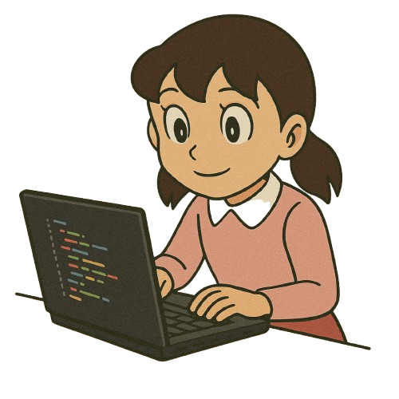
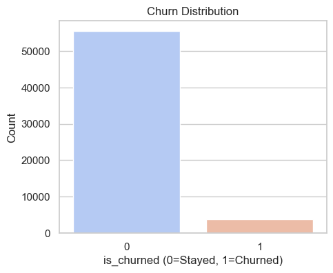
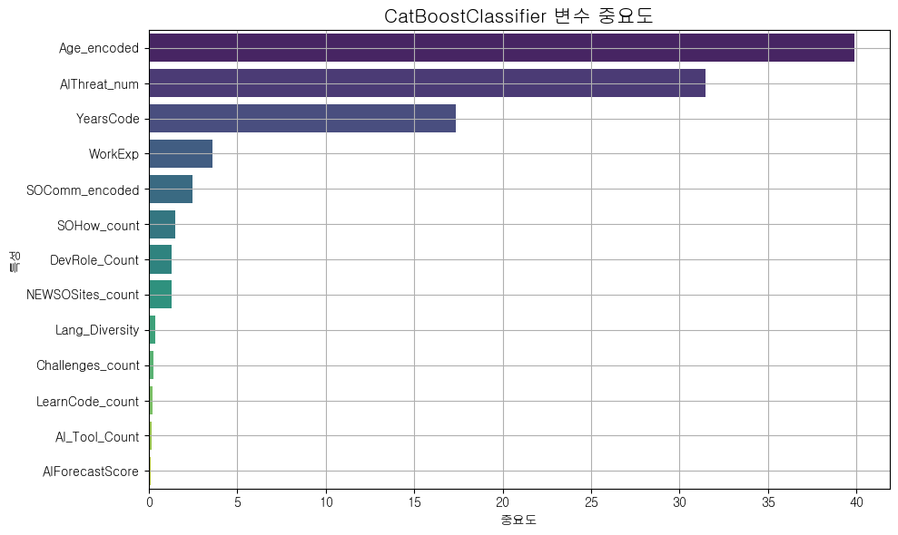
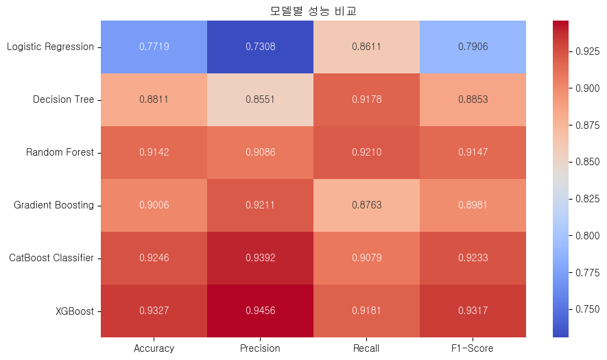
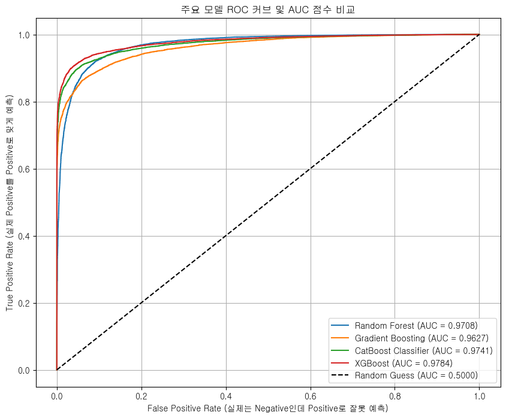
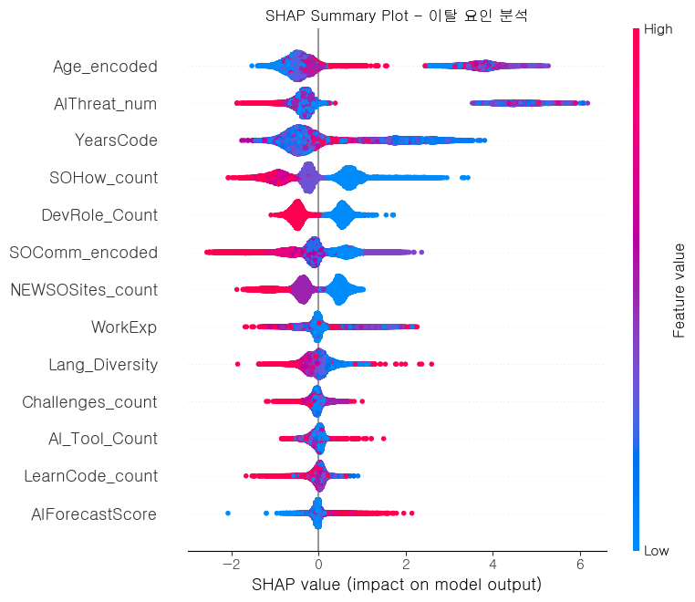

# **Stack Overflow 핵심 개발자 이탈 예측 및 활성화 방안 연구**

## 1. **팀 소개**

### GPT한테 물어볼게요
"왜 이탈하냐고요? GPT한테 물어보거든요."

<br>

## 🌟 **팀원 소개**  

| 정의중 | 임길진 | 이민영| 신승철 | 김주서 |
|---|---|---|---|---|
|  |  |  |  |  | 
|[@uii42](https://github.com/uii42)| [@LGJ0405](https://github.com/LGJ0405) | [@mylee99125](https://github.com/mylee99125) | [@ssshinnpson](https://github.com/ssshinnpson) | [@kimjuseo71](https://github.com/kimjuseo71)|

<br>

## 2. 프로젝트 개요

### 2.1 프로젝트 주제 선정 배경

2023년을 기점으로 ChatGPT와 같은 생성형 AI 도구가 보편화되면서 개발자들의 정보 검색 및 문제 해결 방식에 패러다임 전환이 일어나고 있다. 이로 인해 세계 최대 개발자 Q&A 커뮤니티인 Stack Overflow는 질문 및 답변 수가 급감하는 심각한 도전에 직면했다.

이는 단순한 트래픽 감소를 넘어, 커뮤니티의 지식 생태계를 지탱해 온 **핵심 개발자(High-contribution developers)들의 이탈**을 가속화할 수 있다. 전문가들의 이탈은 곧 답변의 질적 저하로 이어지고, 이는 다시 일반 사용자들의 이탈을 유발하여 플랫폼의 장기적인 신뢰도와 가치를 훼손하는 악순환을 낳을 수 있다.

본 프로젝트는 설문 데이터를 기반으로 **이탈 가능성이 높은 개발자를 선제적으로 예측**하고, 커뮤니티의 지속 가능성을 위한 해결 방안을 모색하고자 시작되었다.

<br>


<br>


출처: The Decline of Stack Overflow, Tomaž Weiss
<br>

### 2.2 프로젝트 목적
본 프로젝트의 목표는 다음과 같다.

1. **핵심 이탈 요인 분석**
    - 머신러닝 모델의 Feature Importance 분석을 통해, 개발자 이탈에 영향을 미치는 **핵심 요인을 식별하고 정량적으로 제시**한다.
2. **솔루션 프로토타입 제안**
    - 분석된 인사이트를 바탕으로, 이탈 고위험군 사용자에게 **개인화된 활성화 솔루션을 제공하는 Streamlit 프로토타입을 구현**한다.

### 2.3 데이터 출처

- Stack Overflow Annual Developer Survey: https://survey.stackoverflow.co/ 설문 데이터

<br>

## 3. **기술 스택**

| **분류**       | **기술/도구** |
|----------------|------------------------------------------------------------------------------------------------------------------------------------------------------------------------------------------------------------------------------------------------------------------|
| **언어**       |  |
| **데이터 처리** |   |
| **시각화**     |   |
| **모델링**     |    |
| **불균형 처리** |  |
| **모델 저장**   |  |
| **협업 툴**     |   |

<br>

## 4. WBS


<br>

## 5. 데이터 전처리 및 EDA (탐색적 데이터 분석)

모델링에 사용할 주요 변수를 선정하고, 결측치 처리 및 파생 변수 생성을 통해 데이터를 정제한다.
또한 텍스트 형태의 다중 응답 데이터를 수치화하고, 순서형 변수는 인코딩하여 모델이 학습할 수 있는 형태로 변환한다.

#### 분석 타겟 컬럼

| 변수명 | 설명 | 데이터 타입 |
|--------|------|--------------|
| `LearningCode_count` | 코딩 학습 방법 개수 | `int64` |
| `Lang_Diversity` | 사용 프로그래밍 언어 다양성 | `int64` |
| `AI_Tool_Count` | 사용 중인 AI 도구 수 | `int64` |
| `WorkExp` | 실무 경력 | `float64` |
| `YearsCode` | 코딩 경험 연차 | `float64` |
| `DevRole_Count` | 담당 개발 역할 수 | `int64` |
| `SOHow_count` | Stack Overflow 방문 이유 개수 | `int64` |
| `SOComm_encoded` | Stack Overflow 커뮤니티 인식 수준 | `int64` |
| `NEWSOSites_count` | Stack Overflow 외 사이트 방문 수 | `int64` |
| `Age_encoded` | 나이 | `float64` |
| `Challenges_count` | AI 도구 사용 시 겪는 문제 수 | `int64` |
| `AIForecastScore` | AI 전망 점수 | `int64` |
| `AIThreat_num` | AI 위협 인식 수준 (수치화) | `float64` |
| `is_churned` | 이탈 여부 (타겟 변수) | `int64` |

<br>

#### 결측치 처리

``` python
df = df.dropna(subset=['SOVisitFreq'])
df['WorkExp'] = df['WorkExp'].fillna(0)
df['YearsCode'] = df['YearsCode'].replace({
    'Less than 1 year': 0.5,
    'More than 50 years': 51
}).astype(float).fillna(0)
for col in [
    'AIToolCurrently Using',
    'AINextMuch more integrated',
    'AINextMore integrated',
    'AIChallenges'
]:
    df[col] = df[col].where(pd.notnull(df[col]), np.nan)
df['AIThreat'] = df['AIThreat'].fillna("I'm not sure")

df = df.dropna(subset=['Age_encoded'])

df['SOComm_encoded'] = df['SOComm_encoded'].fillna(0)
```

<br>

#### countMultipleResponses 함수

``` python
def countMultipleResponses(value):
    if pd.isna(value) or str(value).strip() == "":
        return 0
    return len(re.findall(r"[;,]", str(value))) + 1
```

<br>

#### 개수로 처리한 column

``` python
df['LearnCode_count'] = df['LearnCode'].apply(countMultipleResponses)
df['Lang_Diversity'] = df['LanguageHaveWorkedWith'].apply(countMultipleResponses)
df['AI_Tool_Count'] = df['AIToolCurrently Using'].apply(countMultipleResponses)
df['DevRole_Count'] = df['DevType'].apply(countMultipleResponses)
df['SOHow_count'] = df['SOHow'].apply(countMultipleResponses)
df['NEWSOSites_count'] = df['NEWSOSites'].apply(countMultipleResponses)
df['Challenges_count']= df['AIChallenges'].apply(countMultipleResponses)

```

<br>

#### encoding 처리한 column

``` python
so_comm_order = {
    'No, not at all': 0,
    'No, not really': 1,
    'Not sure': 2,
    'Neutral': 3,
    'Yes, somewhat': 4,
    'Yes, definitely': 5
}

df['SOComm_encoded'] = df['SOComm'].fillna('Neutral').map(so_comm_order)

df['AIThreat_num'] = df['AIThreat'].map({
    'Yes': 1,
    'No': 0,
    "I'm not sure": 0.5
})

age_order = {
    'Under 18 years old': 0,
    '18-24 years old': 1,
    '25-34 years old': 2,
    '35-44 years old': 3,
    '45-54 years old': 4,
    '55-64 years old': 5,
    '65 years or older': 6,
    'Prefer not to say': np.nan
}

df['Age_encoded'] = df['Age'].map(age_order)
```

<br>

#### AIForecastScore 도출

``` python
df['AINextMuch_more_count'] = df['AINextMuch more integrated'].apply(countMultipleResponses)
df['AINextMore_count'] = df['AINextMore integrated'].apply(countMultipleResponses)
df['AINextLess_count'] = df['AINextLess integrated'].apply(countMultipleResponses)
df['AINextMuch_less_count'] = df['AINextMuch less integrated'].apply(countMultipleResponses)

df['AIForecastScore'] = (
    df['AINextMuch_more_count'] * 2 
    + df['AINextMore_count']
    - df['AINextLess_count']
    - df['AINextMuch_less_count'] * 2
)
```

<br>

#### label column

타겟 변수인 `is_churned`(이탈 여부)의 분포가 심각한 불균형을 이루고 있어, 소수 클래스(이탈 그룹)의 예측 성능을 높이기 위해 **SMOTE** 기법으로 데이터를 증강했습니다.

``` python
df['is_churned'] = df['SOVisitFreq'].apply(lambda x: 1 if x in ['Less than once per month or monthly', 'I don’t visit Stack Overflow'] else 0)
```

<br>

<div align='center'>



</div>

<br>

#### 히트맵


<br>

## 6. 인공지능 학습 결과서

### 모델별 학습 결과

- ### Logistic Regression: 로지스틱 회귀 <br>

```
🔍 최적 임계값 (Optimal threshold): 0.41
✅ 학습 정확도: 0.7764806104818583

✅ 정확도 (Accuracy): 0.7719026707940393
✅ 정밀도 (Precision): 0.7307551319648093
✅ 재현율 (Recall): 0.861061118709956
✅ F1 Score: 0.7905747050464325

📊 혼동 행렬 (Confusion Matrix):
[[ 9484  4407]
[ 1930 11961]]

📋 분류 리포트 (Classification Report):
              precision    recall  f1-score   support

          0       0.83      0.68      0.75     13891
          1       0.73      0.86      0.79     13891

    accuracy                           0.77     27782
  macro avg       0.78      0.77      0.77     27782
weighted avg       0.78      0.77      0.77     27782
```

<br>


<br>

- ### Decision Tree : 결정 트리 회귀 <br>

```DecisionTreeClassifier:
🔍 최적 임계값 (Optimal threshold): 0.36
✅ 학습 정확도: 0.9341524284891534

✅ 정확도 (Accuracy): 0.8811100712691671
✅ 정밀도 (Precision): 0.8550637156270959
✅ 재현율 (Recall): 0.9177884961485854
✅ F1 Score: 0.8853164820665949

📊 혼동 행렬 (Confusion Matrix):
 [[11730  2161]
 [ 1142 12749]]

📋 분류 리포트 (Classification Report):
               precision    recall  f1-score   support

           0       0.91      0.84      0.88     13891
           1       0.86      0.92      0.89     13891

    accuracy                           0.88     27782
   macro avg       0.88      0.88      0.88     27782
weighted avg       0.88      0.88      0.88     27782
```
<br>


<br>

- ### Random Forest : 랜덤 포레스트 회귀 <br>

```
RandomForestClassifier
🔍 최적 임계값 (Optimal threshold): 0.49
✅ 학습 정확도: 0.941183528508351

✅ 정확도 (Accuracy): 0.9141530487365921
✅ 정밀도 (Precision): 0.90859375
✅ 재현율 (Recall): 0.9209560146857677
✅ F1 Score: 0.9147331164420293

📊 혼동 행렬 (Confusion Matrix):
 [[12604  1287]
 [ 1098 12793]]

📋 분류 리포트 (Classification Report):
               precision    recall  f1-score   support

           0       0.92      0.91      0.91     13891
           1       0.91      0.92      0.91     13891

    accuracy                           0.91     27782
   macro avg       0.91      0.91      0.91     27782
weighted avg       0.91      0.91      0.91     27782
```
<br>


<br>

- ### Gradient Boosting : 그래디언트 부스팅 회귀 <br>

```
GradientBoostingClassifier:
🔍 최적 임계값 (Optimal threshold): 0.50
✅ 학습 정확도: 0.9035683432520637

✅ 정확도 (Accuracy): 0.9006191058959038
✅ 정밀도 (Precision): 0.9210805084745762
✅ 재현율 (Recall): 0.876322798934562
✅ F1 Score: 0.8981443907477773

📊 혼동 행렬 (Confusion Matrix):
 [[12848  1043]
 [ 1718 12173]]

📋 분류 리포트 (Classification Report):
               precision    recall  f1-score   support

           0       0.88      0.92      0.90     13891
           1       0.92      0.88      0.90     13891

    accuracy                           0.90     27782
   macro avg       0.90      0.90      0.90     27782
weighted avg       0.90      0.90      0.90     27782
```

<br>

- ### CatboostCalssifier : 캣부스트 분류기 <br>

```
CatBoostClassifier:
🔍 최적 임계값 (Optimal threshold): 0.46
✅ 학습 정확도: 0.9269293530428105

✅ 정확도 (Accuracy): 0.9245914620977611
✅ 정밀도 (Precision): 0.9392314566577301
✅ 재현율 (Recall): 0.9079259952487222
✅ F1 Score: 0.9233134448552289

📊 혼동 행렬 (Confusion Matrix):
 [[13075   816]
 [ 1279 12612]]

📋 분류 리포트 (Classification Report):
               precision    recall  f1-score   support

           0       0.91      0.94      0.93     13891
           1       0.94      0.91      0.92     13891

    accuracy                           0.92     27782
   macro avg       0.93      0.92      0.92     27782
weighted avg       0.93      0.92      0.92     27782
```

<br>



<br>

- ### XGBoost : eXtreme Gradient Boosting 회귀 <br>

```
XGBClassifier:
🔍 최적 임계값 (Optimal threshold): 0.46
✅ 학습 정확도: 0.9445550969475907

✅ 정확도 (Accuracy): 0.9326542365560435
✅ 정밀도 (Precision): 0.9456473379801276
✅ 재현율 (Recall): 0.9180764523792384
✅ F1 Score: 0.9316579610622056

📊 혼동 행렬 (Confusion Matrix):
 [[13158   733]
 [ 1138 12753]]

📋 분류 리포트 (Classification Report):
               precision    recall  f1-score   support

           0       0.92      0.95      0.93     13891
           1       0.95      0.92      0.93     13891

    accuracy                           0.93     27782
   macro avg       0.93      0.93      0.93     27782
weighted avg       0.93      0.93      0.93     27782
```
<br>


<br>

### 

- ### 모델 성능 시각화



총 6개의 모델을 학습 및 평가한 결과, **XGBoost가 F1-Score 0.93**으로 가장 우수한 성능을 보여 최종 모델로 선정하였다.

<br>

- ### ROC curve



XGBoost 곡선이 다른 모델들 곡선보다 미세하게나마 위쪽에 위치한 것을 확인할 수 있다. 이는 XGBoost 모델이 가장 안정적으로 좋은 성능을 내고 있다는 것을 다시 한 번 보여준다.

<br>

- ### XGB 모델 shap plot



가장 성능이 좋다고 판단되는 XGBoost 모델이 특정 사용자가 **왜 이탈 가능성이 높다고 생각했는지** 각 feature별로 보여주는 자료다. y축은 해당 feature 값이 바뀔 때 모델 출력이 얼마나 변하는지 영향력을 기준으로 나열된다. X축은 0을 기준으로 양수쪽으로 갈 수록 음수로 갈수록 이탈 확률을 낮추는 요인이다. 각 점의 색은 해당 변수값의 높이값을 의미해 빨간색은 높은 값, 파란색은 낮은 값을 의미한다.

<br>

## 7. 솔루션 프로토타입: Streamlit 기반 추천 시스템

분석 결과를 바탕으로, 사용자가 직접 정보를 입력하면 **이탈 위험도를 예측**하고 **개인화된 커뮤니티 활동 계획을 추천**해주는 웹 애플리케이션을 Streamlit으로 구현하였다. 시스템의 작동 방식은 다음과 같다.

1. **이탈 확률 예측**: XGBoost 모델을 통해 사용자의 이탈 확률을 실시간으로 계산한다.
2. **리스크 점수 산출**: CatBoost 모델로 '이탈 리스크 점수'를 산출하여 상위 위험군을 식별한다.
3. **유지 그룹 행동 분석**: 이탈하지 않은 사용자 중, 같은 직무와 비슷한 연령대의 '유지 그룹'의 행동 패턴을 분석한다.
4. **개인화 추천 생성**: 리스크가 높은 사용자가 현재 하지 않는 활동 중, '유지 그룹'이 가장 많이 하는 행동을 추천한다.
5. **실행 계획 제공**: 추천된 활동을 주간 루틴, 질문 템플릿, 저장 검색 쿼리 등 구체적인 실행 계획으로 변환하여 제공한다.


<br>


<br>


<br>

## 결론

### 🔍 주요 인사이트
본 프로젝트에서는 Stack Overflow 핵심 기여자의 이탈 여부를 예측하기 위해 다양한 머신러닝 모델을 비교·분석한 결과, **XGBoost 모델이 Accuracy 93.27%, F1 Score 0.93**으로 가장 우수한 성능을 보였다.

데이터 분석 결과, **AI 활용 여부는 이탈 여부와 뚜렷한 상관관계를 보이지 않았다**. 대신, 변수 중요도 분석에서 **SOHow_count**(커뮤니티 방문 사유 수), **NEWSOSites_count**(다른 Stack Overflow 사이트 이용 수), **DevRole_Count**(개발자 역할 수), **SOComm_encoded**(커뮤니티 인식 수준) 네 가지 변수가 예측 정확도에 크게 기여하는 핵심 요인으로 나타났다.  

또한, 데이터 분포 분석에서 **심각한 클래스 불균형**이 확인되었으며, 모델이 다수 클래스에 치우쳐 소수 클래스 예측 성능이 저하될 가능성이 크다. 이를 개선하기 위해 **SMOTE** 기법을 적용하여 모델 학습 안정성과 소수 클래스 예측 성능을 향상시켰다.  

### ⚠ 한계점
- **설문 기반 데이터 한계**: Stack Overflow 설문 응답 데이터에 기반하여, 응답자의 자기보고 편향이 존재할 수 있음.  
- **일시적 스냅샷 데이터**: 단일 시점 데이터로 장기적인 추세 반영이 어려움.  
- **설명 변수 제약**: SOHow_count, NEWSOSites 등 일부 행동 지표만 포함되어, 실제 이탈에 영향을 줄 수 있는 다른 요인을 충분히 반영하지 못함.
- **불균형 데이터 보정의 한계**: SMOTE 적용으로 소수 클래스 예측 성능은 개선했으나, 합성 데이터가 실제 행동 패턴을 완전히 대변하지는 못함.

### 💡 제안 방안
- **개인화된 리텐션 전략**: 방문 사유가 감소하거나 특정 개발 역할 활동이 줄어드는 사용자를 대상으로 맞춤형 알림, 추천 질문, 관심 주제 콘텐츠 제공.
- **커뮤니티 인식 개선 프로그램**: SOComm 점수가 낮은 사용자에게 커뮤니티 가치와 기여 혜택을 강조하는 온보딩 콘텐츠 제공.
- **행동 로그 기반 변수 추가**: 주기적 설문 실시, 답변 채택, 댓글 참여 등의 세부 로그 데이터를 결합하여 예측 정밀도 향상.

<br>

🌈 **팀원 한 줄 회고**
<table>
  <tr>
    <th>이름</th>
    <th>회고 내용</th>
  </tr>
  <tr>
    <td>정의중</td>
    <td></td>
  </tr>
  <tr>
    <td>임길진</td>
    <td></td>
  </tr>
  <tr>
    <td>신승철</td>
    <td></td>
  </tr>
  <tr>
    <td>이민영</td>
    <td></td>
  </tr>
  <tr>
    <td>김주서</td>
    <td></td>
  </tr>
</table>

<br>


<br>
